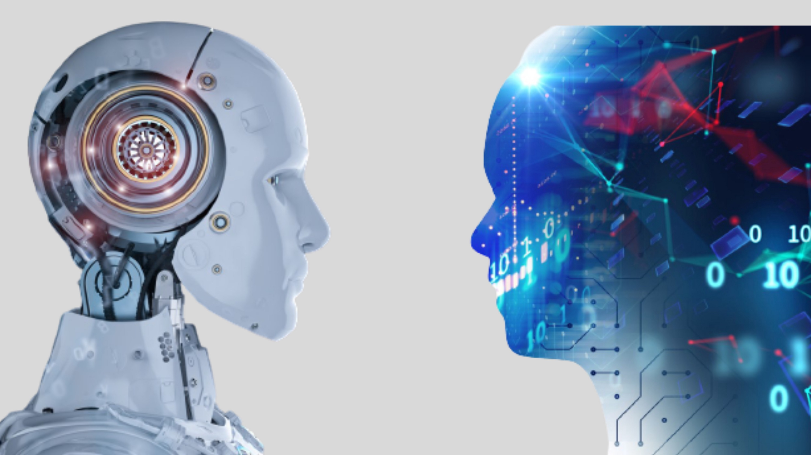

## Ignition
My programming experience began in the 2nd grade. I was accepted into the enrichment program at my elementary school and one activity that they did was robotics. At that time, I did not know what programming was and just found it interesting that I could control the movements of the robot through the computer. Trying to get the robot to move its manipulators and wheels to complete the task given to us was very fun. At first, we started off with block coding but after I started to understand the basics, I switched to text-based coding. Robotics was all I knew about programming but in middle school, my eyes were opened. Technology started to grow and many things were innovated. I got my first smartphone during that time, and realized that everything I enjoyed, there was some kind of code behind it. All the games I played and websites I used to do homework, were all programmed by people. This was what ignited the first fire for programming in my heart. 

## Light Bulb
Through middle school, I continued to do robotics and different stem-related projects. However, from my freshman year to junior year in high school, we did not have a robotics team. During those 3 years, I lost all interest in programming because I did not have any activities to do. I focused on getting a good GPA and switched my goal to the medical field. However, for 3 years, I was extremely bored and could not find my passion in the medical field. In my senior year, I did not know what I wanted to major in and lost a lot of hope. But suddenly, one of the teachers I knew founded a robotics club. I joined instantly and volunteered to be a programmer. I also registered for a computer science class because I wanted to find passion and hope. I believe I made the right choice. My senior year was the best year of my high school career, and I achieved so many things. We were a rookie team (1st-year team) but we managed to win many awards, and even qualified for the State and National Championships. Our robotics team even participated in our school hackathon and we won. Through this whole process I realized I almost made the wrong decision to go into the medical field. Being a founding member and head programmer of the robotics team again gave me a light bulb moment on what I wanted to do in the future.  

## Next Mission
In the near future, I would like to learn more languages and become more skilled with the languages I currently know. I would like to get familiar with more frameworks, which would lead me to land internships and positions in different areas of Computer Science. My end goal is to be employed in a position in either AI development or software engineering. I would also like to travel around the world and share my knowledge.

