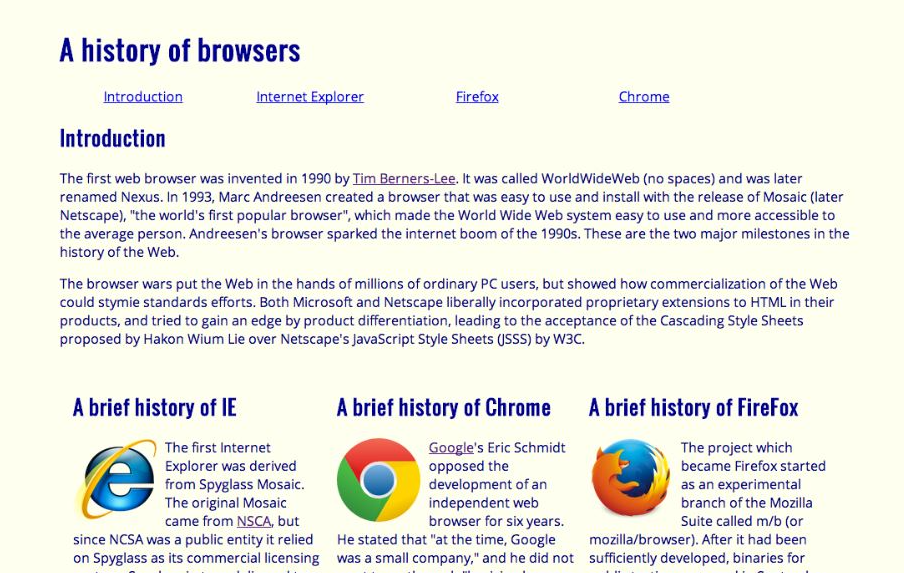
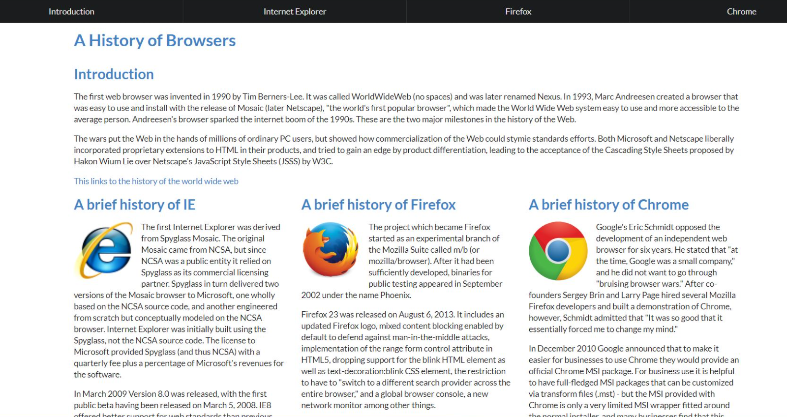

## First Ever UI Framework
Before taking this class on Software Engineering, I have never incorporated a UI framework like Semantic UI. I always struggled to get the design I wanted with HTML and CSS, but even then I was very limited in what I could do. It was interesting to learn that everything I did with HTML and CSS could be done easier with a few calls in Semantic UI. 

Whenever I used HTML and CSS to design a website, it took long hours and days to get my website looking the way I wanted it to. Sometimes it gets annoying to get the alignment or positioning correct, or changing the features of certain parts. Whenever I want to change something on my website with only CSS, it takes me way too many lines to change one simple element. However, I learned that I have to understand what the different calls in Semantic UI do because even though it does reduce the amount of lines, I still use more calls and functions than I need to change different elements.

## Experiencing Semantic
I have previous experiences of building websites using only HTML and CSS, starting from my highschool years. Although presentable, the resulting page looked like all the work I put in was the bare minimum and looked like something from the old days. I had many issues with making the media queries that control what the elements look like on different screen sizes. Struggling with HTML and CSS allowed me to understand what I’m doing behind the scenes of the UI frameworks. It allowed me to figure out what I need to change and how I should manipulate the different containers and elements. 

You can tell the difference between these two pictures. The webpage that was designed and developed using Semantic UI looks cleaner. With semantic UI, we can create a navbar using only a few calls of a few classes assigned to the div tags, reducing the amount of code and lines needed. When we create the page without a framework, we are limited to what it can look like and what we can do.

## Semantic Makes Life Easier
