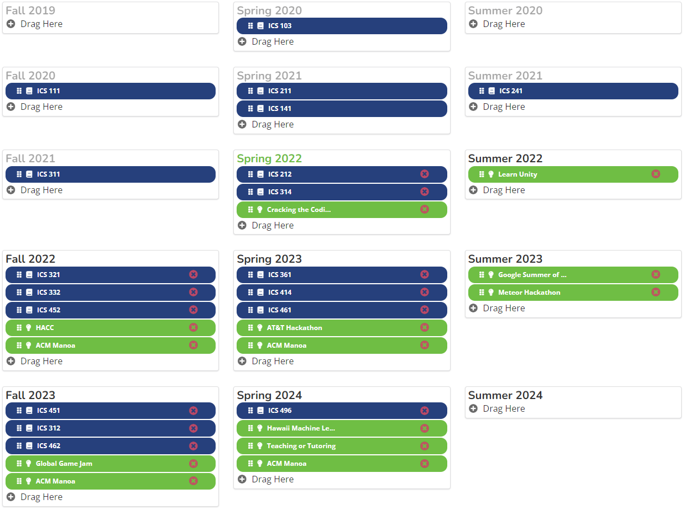

## How to Start on my Path?
Many people choose to go to college to get their degrees and get qualifications required for a high-paying job. However, as we all know, just because you have a college degree, it does not guarantee a well-paid job. Many job markets are very competitive and getting your degree itself is very expensive and time consuming. Some students have to support themselves, without any support from friends or family and this can make it hard for them to achieve their dreams and start on their career. They can end up lost and lose their starting point on their path. Thankfully, RadGrad attempts to guide these students and provide them with opportunities, goals and courses that can help them start on their path in career development. 

For me personally, RadGrad is a new experience and tool, but I have already implemented many of the features on the platform in my school life. I have been planning my degree from day one and I looked for opportunities such as competitions and internships. However, RadGrad introduced me to many opportunities, interests, and courses that I didn't know existed. Using what is provided, I was able to improve the plan I had and figured out new things I wanted to try and experiment with. 

## Experience RadGrad
Although I like to be organized and set goals, sometimes it can get overwhelming and I lose track of what I wanted to do. Eventually, it led me to lose motivation and focus because I had no idea what I wanted to do after I got my degree. RadGrad showed me that there is more to the computer science world than I originally thought. There are a lot of goals and opportunities out there that I did not know much about. RadGrad can show us a list of opportunities, courses, and careers based on what we are interested in. It helped me to narrow down what I might want to do in the future. The platform also gives us feedback on how much our choices will help us in different aspects and if it will lead us to completion. 

I appreciated the descriptions and video explanations of what is required of these different jobs because it helped me to understand what I would do to some degree. The vast pool of options helped me to think more about what field of computer science I want to go into and where I should set my standards. I know for sure I would like to go into software development or artificial intelligence. 

## Worth It?
I believe RadGrad can be worth it to some individuals. Those who do not know what they want to do, those who do not have any guidance, etc. RadGrad is a great platform for those individuals to start on their path and plan out their degree and future. It is a platform that can help us see the vast pool of opportunities and careers waiting for us. For me personally, although RadGrad showed me more opportunities that I did not know about, it did not really benefit me in terms of improving my academic development since I already had my courses planned out and some internships and competitions that I wanted to join. However, I may continue to use the platform just to keep track of what I still have left to do to complete my degree. 

RadGrad is beneficial in planning out and helping with maximizing your degree experience. I believe the point tracker is helpful since it helps visualize what different opportunities will guide you to like innovation, competency, and experience. This allows students to choose opportunities, courses, and goals that will help their degree experience. One aspect that would be nice to add to this platform is connections or resources that connect you to companies that pertain to your interests and goals.

