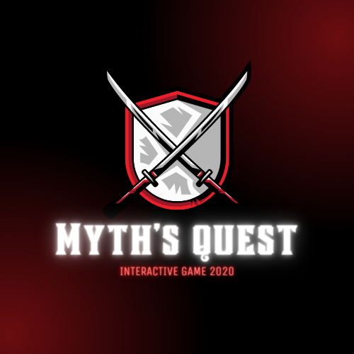

This interactive game was built using Python on a site called repl. I got the idea for this game based on the Netflix series, Black Mirror: Bandersnatch. The concept was that the choices you make at certain points in the story, affects the ending. You are making your own adventure. 

In my interactive game, which I called "Myth's Quest," you have to successfully find the 3 artifacts to open the portal to return home. I started off by making a diagram of all the choices you could make and what each choice led to. The diagram helped me to keep track where I was when I was coding the game. It took me about a week to finish the entire game, and at that time was my longest project I worked on. The game has 5 different endings:
#1.Successfully retrieve all artifacts to open the portal back home and both worlds remain in peace
#2.Fail, get caught by officers, dead
#3.Succeed, but the Young Threats also successfully took over the kingdom, which makes life harder for people
#4.Chose the wrong artifact, died by an explosion
#5.Failed to collect all 3 artifacts
 
Source: <a href = "https://github.com/Cknakano/Myth-s-Quest"><i class="large github icon"></i>Cknakano/Myth-s-Quest</a>.

